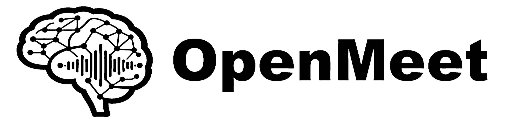
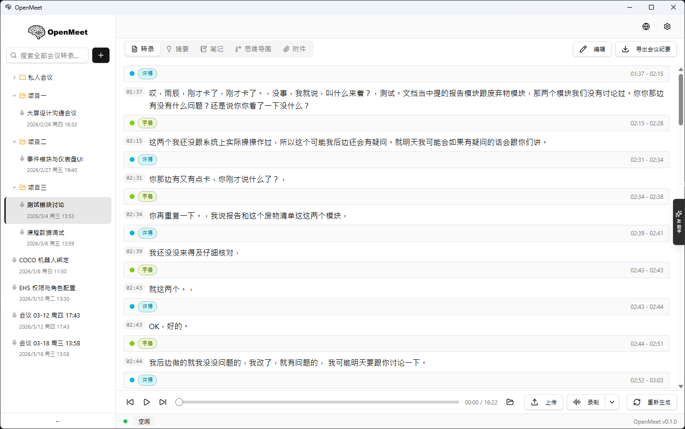
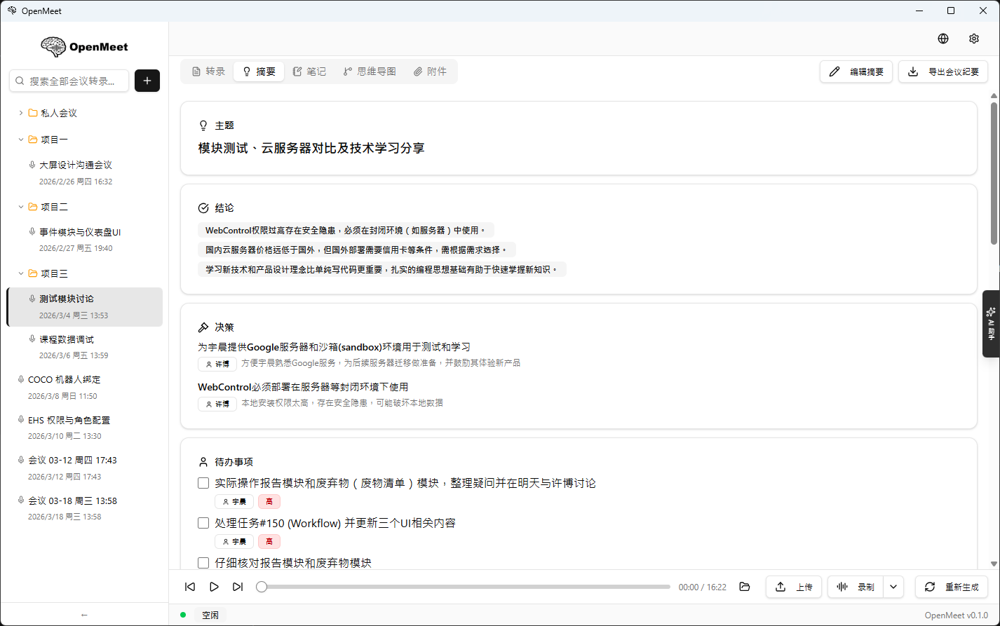
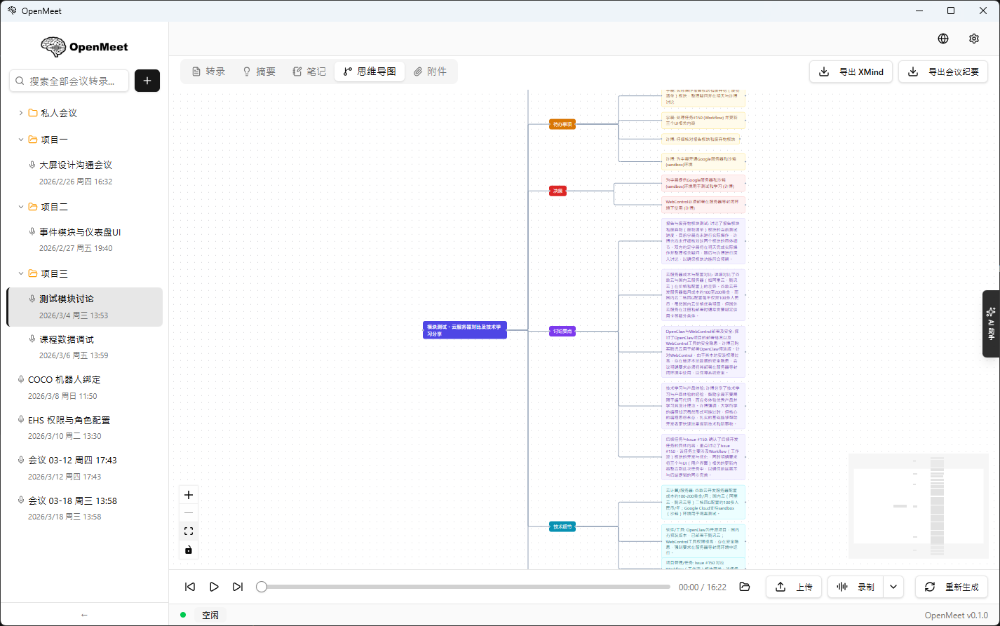
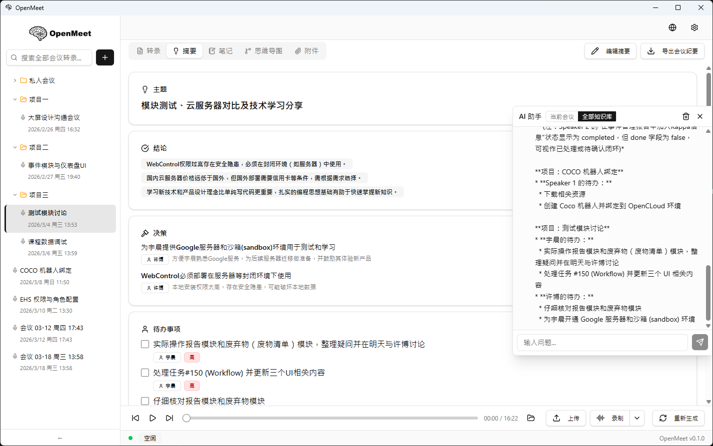
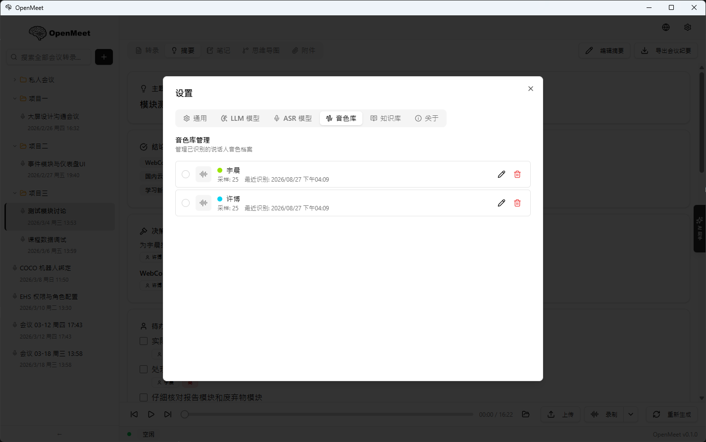
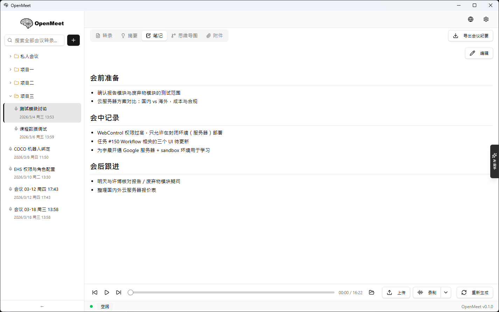
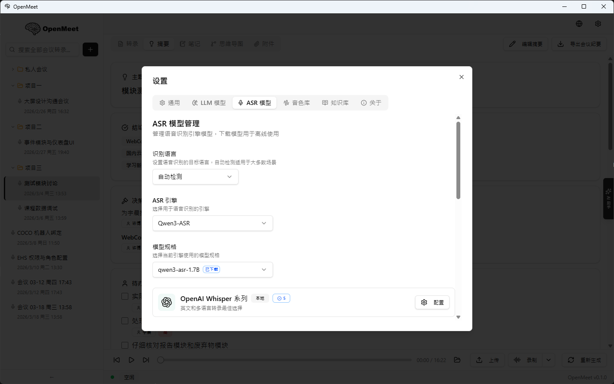
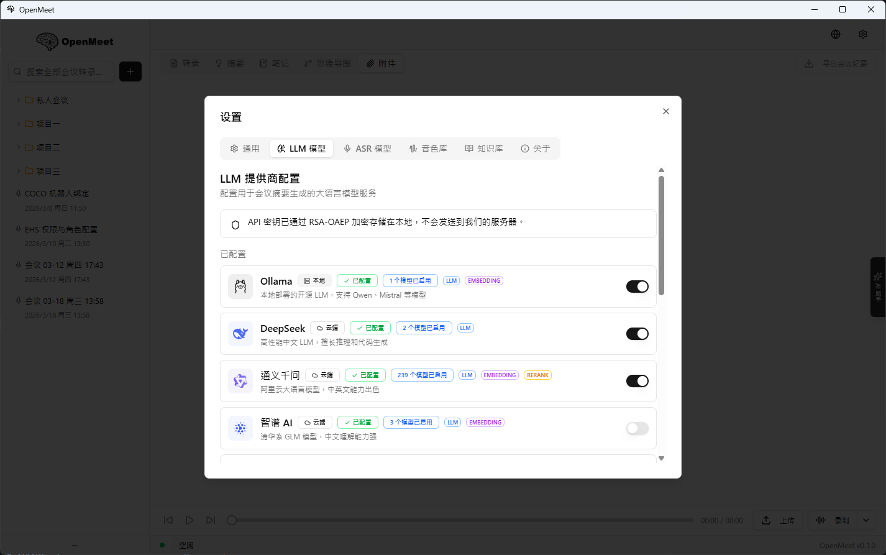
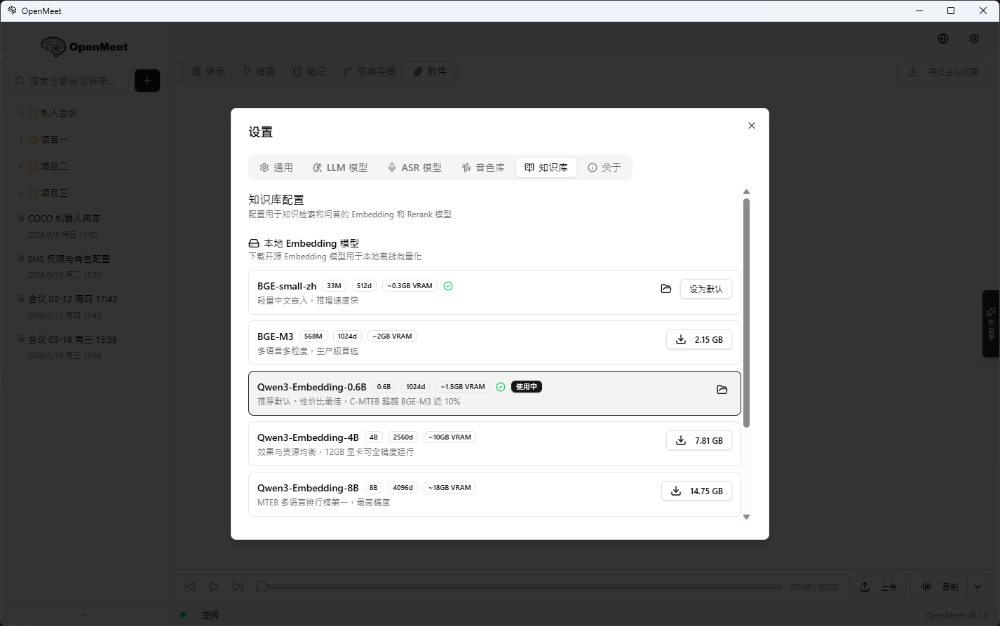

<div align="center">



### 本地优先的 AI 会议助手

**转录 · 识人 · 纪要 · 知识库 —— 全部在你自己的电脑上完成**

[](https://github.com/FellforU/OpenMeet/releases)
[](LICENSE)
[]()
[]()
[]()

[中文](#-为什么是-openmeet) · [English](#english) · [下载安装](#-快速开始) · [配置指南](docs/configuration-guide.md) · [联系作者](#-联系作者)

<br/>



<sub>转录工作区 —— 每句话都标好了「谁、什么时候、说了什么」，点击即可跳转到对应音频位置</sub>

</div>

---

## ✨ 为什么是 OpenMeet？

开完一场会，你可能要面对这些事：凭记忆补纪要、在录音里反复拖进度条找某句话、分不清"这话是谁说的"、上个月讨论过的结论怎么也找不到。市面上的 AI 会议工具能解决一部分，但代价是**把公司会议录音传到别人的服务器上，再按月付订阅费**。

OpenMeet 选择另一条路：

| 你的痛点 | OpenMeet 的答案 |
|---|---|
| 🔒 会议内容敏感，不敢上传云端 | 语音识别、说话人分离、声纹识别全部**本地推理**，一个字节都不用出你的电脑 |
| 💸 订阅制工具按月收费 | **免费开源（MIT）**，本地模型零成本；愿意的话也可以接入自己的云端 API |
| ✍️ 会后整理纪要费时费力 | 一键生成**结构化纪要**：议题、结论、决策、待办（含负责人/截止时间）、思维导图 |
| 🗣️ 转录稿分不清谁在说话 | 说话人自动分离 + **声纹库跨会议识人**——标注过一次"张三"，下次开会自动认出他 |
| 🔍 历史会议内容找不到 | 全局搜索直达任意会议的任意一句话；**知识库 RAG** 支持用自然语言向所有会议记录提问 |
| 🌐 断网 / 内网环境不能用 | 模型下载完成后**完全离线可用** |

## 🧩 功能一览

- **多引擎语音识别** — faster-whisper（多语言）、Qwen3-ASR（方言与噪声鲁棒）、Paraformer（中文快且准），另支持 OpenAI / 阿里云 API 和自定义魔搭模型
- **实时流式转写** — 边录边出字，麦克风与系统声音均可采集
- **八道后处理工序** — 幻觉清理 → 数字规范化 → 语气词过滤 → LLM 智能纠错 → 段落划分 → 标点恢复 → 说话人分离 → 声纹提取，每一步进度实时可见
- **说话人分离 + 声纹库** — pyannote 精确切分发言边界；声纹跨会议持久化，越用越准（被动学习）
- **结构化会议纪要** — 议题 / 结论 / 决策 / 待办事项 / 关键数据，支持 Markdown 编辑、思维导图预览与 XMind 导出
- **知识库与 AI 对话** — 会议记录自动向量化入库（LanceDB），用自然语言检索、追问、总结所有历史会议
- **LLM 自由选择** — Ollama 本地模型，或 DeepSeek / 通义 / 智谱 / Gemini / OpenAI 等 11 家云厂商任选
- **音频回放定位** — 点击任意句子跳转到对应音频位置，同步高亮
- **项目化管理** — 文件夹分组、全局转录搜索、多格式导出（Markdown / JSON / TXT）
- **中英双语界面**

## 📸 界面预览

<table>
  <tr>
    <td width="50%" align="center"><b>结构化纪要</b><br/><sub>主题 · 结论 · 决策 · 待办（负责人 / 优先级）</sub></td>
    <td width="50%" align="center"><b>思维导图</b><br/><sub>一键从纪要生成，可导出 XMind</sub></td>
  </tr>
  <tr>
    <td></td>
    <td></td>
  </tr>
  <tr>
    <td align="center"><b>知识库 AI 对话</b><br/><sub>跨所有历史会议用自然语言提问</sub></td>
    <td align="center"><b>声纹库</b><br/><sub>标注一次，以后每场会议自动认人</sub></td>
  </tr>
  <tr>
    <td></td>
    <td></td>
  </tr>
  <tr>
    <td align="center"><b>会议笔记</b><br/><sub>Markdown 所见即所得，随转录一起入知识库</sub></td>
    <td align="center"><b>ASR 模型管理</b><br/><sub>应用内一键下载，魔搭国内源直连</sub></td>
  </tr>
  <tr>
    <td></td>
    <td></td>
  </tr>
  <tr>
    <td align="center"><b>LLM 提供商</b><br/><sub>Ollama 本地或 11 家云厂商，密钥本地 RSA 加密</sub></td>
    <td align="center"><b>知识库 Embedding</b><br/><sub>BGE / Qwen3-Embedding 多档可选</sub></td>
  </tr>
  <tr>
    <td></td>
    <td></td>
  </tr>
</table>

## 🎬 一场会议在 OpenMeet 里是这样流转的

```
 录音 / 导入音频 ──► 语音识别 ──► 八道后处理 ──► 转录稿（谁·何时·说了什么）
                                                       │
                       ┌───────────────────────────────┼───────────────────┐
                       ▼                               ▼                   ▼
                  结构化纪要                        思维导图            知识库向量化
              （议题/结论/决策/待办）              （XMind 导出）      （跨会议 AI 问答）
```

1. **录** — 点「录制」采集麦克风 / 系统声音，或直接「上传」已有录音
2. **转** — 本地 ASR 引擎转写，后处理流水线逐步清理幻觉、纠错、加标点、切分说话人
3. **认** — 声纹库自动匹配出「这是张三」；没见过的人标注一次，下次自动认出
4. **读** — 一键生成纪要与思维导图，Markdown 随手改，导出即可发群
5. **问** — 「上次讨论定价的结论是什么？」——知识库跨所有会议检索并作答

## 🚀 快速开始

### 方式一：下载安装包

前往 [Releases](https://github.com/FellforU/OpenMeet/releases) 下载对应平台安装包：

| 平台 | 文件 |
|------|------|
| Windows | `OpenMeet_x.x.x_x64-setup.exe` |
| macOS | `OpenMeet_x.x.x_aarch64.dmg` |
| Linux | `OpenMeet_x.x.x_amd64.AppImage` |

> 当前版本仍需本地 Python 环境运行 ASR 服务，见下方从源码运行；独立打包在路线图中。

### 方式二：从源码运行

```bash
# 1. 克隆项目
git clone https://github.com/FellforU/OpenMeet.git
cd OpenMeet

# 2. Python 环境（ASR 服务）
python3 -m venv .venv
source .venv/bin/activate          # Linux/macOS
# .venv\Scripts\activate           # Windows
pip install -r asr_service/requirements.txt

# 3. 前端依赖
npm install

# 4. 启动（两个终端）
python -m asr_service.main         # 终端 1：ASR 服务 (:18090)
npm run tauri dev                  # 终端 2：桌面应用
```

首次使用：在应用设置里一键下载所需模型（faster-whisper base 约 140MB 起步；说话人分离模型仅约 32MB）。**全部模型走魔搭（ModelScope）国内源直连下载，无需任何账号、Token 或镜像配置。**

📖 **不知道该选哪个模型？** 看 [配置指南](docs/configuration-guide.md)——按硬件档位和使用场景给出可直接照抄的推荐配置。

> 网络实在受限的环境，可使用离线整合包（含全部模型 + Python 运行环境 + 依赖 wheel）：
> <!-- TODO: 百度网盘链接上传后填到这里 -->
> 百度网盘链接整理中，解压后按包内《离线安装说明.txt》操作即可。

<details>
<summary>各平台系统依赖</summary>

**Linux (Ubuntu/Debian)**

```bash
sudo apt update
sudo apt install -y build-essential libwebkit2gtk-4.1-dev libssl-dev \
    libayatana-appindicator3-dev librsvg2-dev libasound2-dev ffmpeg pkg-config
```

**macOS**

```bash
brew install ffmpeg
xcode-select --install
```

**Windows**

```powershell
# Visual Studio Build Tools（勾选"使用 C++ 的桌面开发"）
# https://visualstudio.microsoft.com/visual-cpp-build-tools/
winget install Gyan.FFmpeg
```

</details>

## 🏗️ 架构

```
┌───────────────────────────────────────────────┐
│  Tauri 桌面应用                                │
│  ┌─────────────┐   ┌───────────────────────┐  │
│  │ React 19 UI │◄──┤ Rust Core             │  │
│  │ · 转录工作区 │   │ · SQLite（会议/声纹）  │  │
│  │ · 纪要/导图  │   │ · 音频采集 (cpal)     │  │
│  │ · 知识库对话 │   │ · 声纹匹配            │  │
│  │ · 全局搜索   │   │ · Sidecar 进程管理    │  │
│  └─────────────┘   └──────────┬────────────┘  │
│                               ▼               │
│  ┌─────────────────────────────────────────┐  │
│  │ Python ASR 服务 (FastAPI :18090)         │  │
│  │ · ASR 引擎（whisper/qwen3/paraformer…） │  │
│  │ · 后处理流水线（8 道工序，并发调度）      │  │
│  │ · pyannote 说话人分离 + 声纹提取         │  │
│  │ · 知识库 RAG（LanceDB + MCP 工具）       │  │
│  └──────────────────┬──────────────────────┘  │
│                     ▼                         │
│  Ollama / 云端 LLM API（纪要·纠错·对话）       │
└───────────────────────────────────────────────┘
```

| 层级 | 技术 |
|------|------|
| 桌面框架 | Tauri 2.x (Rust) |
| 前端 | React 19 + TypeScript + Vite + Tailwind CSS 4 + Radix UI + Zustand |
| ASR 服务 | Python 3.10-3.12 + FastAPI |
| ASR 引擎 | faster-whisper / Qwen3-ASR / FunASR Paraformer / OpenAI API / 阿里云 |
| 说话人分离 | pyannote speaker-diarization-community-1（CAMPPlus 回退） |
| 强制对齐 | Qwen3-ForcedAligner-0.6B（MMS_FA 回退） |
| 知识库 | Qwen3-Embedding / BGE + LanceDB + RAG |
| LLM | Ollama 本地或 11 家云厂商（OpenAI 兼容协议） |
| 存储 | SQLite（会议数据 + 声纹库，API Key RSA 加密） |

## 💻 系统要求

| 配置 | 最低 | 推荐 |
|------|------|------|
| CPU | 4 核 | 8 核+ |
| 内存 | 8 GB | 16 GB+ |
| 硬盘 | 10 GB | 30 GB+（含模型） |
| GPU | 可无（CPU 模式） | NVIDIA 6GB+ VRAM（自动检测并安装 CUDA 版 PyTorch） |

## 🛠️ 开发指南

```bash
# 测试
python -m pytest tests/ -v                    # Python 测试
python -m pytest tests/ --cov=asr_service     # 覆盖率
cd src-tauri && cargo check                   # Rust 类型检查

# 构建
npm run build                                 # 前端（含 TS 检查）
npm run tauri build                           # 桌面应用生产构建
```

<details>
<summary>目录结构</summary>

```
OpenMeet/
├── asr_service/          # Python ASR 后端 (FastAPI)
│   ├── engines/          # ASR 引擎实现
│   ├── processors/       # 后处理工序（VAD/分离/标点/ITN/纠错/对齐）
│   ├── knowledge/        # 知识库 RAG（embedding/向量库/MCP 工具）
│   ├── routers/          # API 路由
│   └── services/         # LLM 客户端、后处理编排
├── src/                  # React 前端
│   ├── components/       # UI 组件（工作区/侧栏/设置/声纹库/对话）
│   ├── stores/           # Zustand 状态
│   ├── services/         # API 客户端
│   └── i18n/             # 中英文案
├── src-tauri/            # Tauri Rust 后端
│   └── src/              # SQLite / 音频采集 / 声纹匹配 / IPC
├── tests/                # Python 测试
└── docs/                 # 设计文档
```

</details>

README 截图由 `tools/screenshot.ps1 <name>` 直接抓取运行中的应用窗口生成（Windows），输出到 `docs/assets/`。

提交规范遵循 [Conventional Commits](https://www.conventionalcommits.org/)：`feat` / `fix` / `perf` / `refactor` / `docs` / `test` / `chore`，正文使用中文描述。

## 🗺️ 路线图

- [x] 多引擎语音识别（本地 3 种 + 云端 2 种 + 自定义模型）
- [x] 实时 WebSocket 流式转写（麦克风 + 系统声音）
- [x] 说话人分离 + 声纹库跨会议识人（被动学习）
- [x] 结构化纪要 + 思维导图 + XMind 导出
- [x] 知识库 RAG 与 AI 对话
- [x] 后处理流水线并发优化与进度可视化
- [x] 全局转录搜索
- [ ] 安装包内置 Python 运行时（免环境配置）
- [ ] faster-whisper 增加 large-v3-turbo 档
- [ ] 中文 ASR 引擎评估 FireRedASR2（公开中文 SOTA）
- [ ] sherpa-onnx Rust 轻量模式（免 Python 依赖的即装即用）
- [ ] 系统音频捕获完善（WASAPI / CoreAudio 回环）
- [ ] 会议模板（站会 / 评审 / 头脑风暴）
- [ ] 多语言实时翻译
- [ ] Windows 代码签名

> 更多技术升级调研结论见 [docs/plans/2026-08-14-tech-upgrade-todo.md](docs/plans/2026-08-14-tech-upgrade-todo.md)

## 🤝 贡献

欢迎 Issue 和 Pull Request！

1. Fork 本仓库
2. 创建功能分支：`git checkout -b feat/my-feature`
3. 提交更改并推送
4. 创建 Pull Request

## 💬 联系作者

觉得项目有用的话，点个 ⭐ Star 是对我最大的鼓励！

使用中遇到问题、有功能建议，或想交流本地 AI 应用开发，欢迎联系：

- **微信**：Noicybino0731（加好友请备注 OpenMeet）
- **Issues**：[提交问题或建议](../../issues)
- **公众号**：宇晨说AI（写 AI 工程落地、Claude Code 工作流、vibe coding 实操）


## 📄 许可证

[MIT License](LICENSE)

---

# English

**OpenMeet** is a local-first AI meeting assistant: transcription, speaker identification, structured minutes, and a searchable knowledge base — everything runs on your own machine.

## Why OpenMeet?

- 🔒 **Privacy by default** — ASR, speaker diarization, and voiceprint recognition all run locally. Not a single byte of your meeting audio leaves your computer.
- 💸 **Free & open source (MIT)** — no subscription; local models cost nothing. Optionally bring your own cloud API keys.
- ✍️ **Minutes, done for you** — structured summaries with topics, conclusions, decisions, action items (owner/deadline), plus mind-map preview and XMind export.
- 🗣️ **Knows who said what** — precise speaker diarization plus a persistent voiceprint library: label "Alice" once and she's recognized in every future meeting.
- 🔍 **Everything is findable** — global full-text search across all meetings, and a RAG knowledge base you can chat with in natural language.
- 🌐 **Fully offline capable** once models are downloaded.

## Key Features

Multi-engine ASR (faster-whisper / Qwen3-ASR / Paraformer / OpenAI / Alibaba / custom ModelScope models) · real-time streaming transcription · 8-stage post-processing pipeline with live progress (hallucination cleanup, ITN, filler filtering, LLM correction, segmentation, punctuation, diarization, voiceprint extraction) · cross-meeting speaker identification with passive learning · structured minutes + mind map · RAG knowledge base (LanceDB) · 11 LLM providers or local Ollama · click-to-seek audio playback · folder-based project management · bilingual UI (zh/en).

## Quick Start

See [快速开始](#-快速开始) above — the commands are identical. In short: set up a Python venv with `asr_service/requirements.txt`, `npm install`, then run `python -m asr_service.main` and `npm run tauri dev`. Download models in-app on first use — all models are served from ModelScope (no account or token required).

## License

[MIT](LICENSE)
